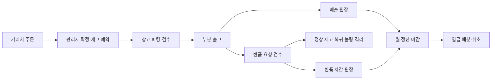

# B2B-STM | 주문부터 정산까지 연결한 유통 업무 시스템

카페·음식점용 포장재·소모품 도매업체를 위한 B2B 웹 애플리케이션입니다. 거래처 주문 포털, 창고 작업 화면, 관리자 화면을 하나의 PostgreSQL 업무 원장으로 연결했습니다.

중점적으로 다룬 문제는 동시 주문의 재고 초과 예약, 통신 재시도로 인한 중복 처리, 부분 출고와 반품 이후의 재고·정산 불일치입니다. 역할별 UI부터 업무 API, DB 정합성, 테스트와 배포까지의 구현을 이 저장소에서 확인할 수 있습니다.

[배포 사이트](https://stm.approid.team) · [설계와 정합성](docs/architecture/transaction-and-module-design.md) · [검증 증빙](docs/portfolio/operational-acceptance-evidence.md) · [10분 데모 동선](docs/portfolio/demo-walkthrough.md)

배포 사이트는 로그인이 필요합니다. 계정 없이도 아래 화면과 설계·검증 자료를 확인할 수 있습니다. 비밀번호와 MFA 비밀값은 공개하지 않습니다.

<details>
<summary>대표 화면: 관리자 운영 대시보드</summary>


샘플 데이터로 촬영한 화면입니다. 표시된 매출과 주문 건수는 실사용 실적이 아닙니다.

</details>

## 핵심 문제와 해결 방식

| 문제 | 구현한 해결 방식 | 확인할 자료 |
|---|---|---|
| 여러 주문이 같은 재고를 동시에 확보 | 주문 확정 시 PostgreSQL 행 잠금 안에서 최신 가용 수량을 확인하고 예약. 부족 잔량은 추가 입고 후 재배정 | [동시 예약·재배정 테스트](scripts/tests/order-reservation.test.mjs) |
| 커밋 직후 응답 유실, 중복 클릭·재전송 | `requestId`와 처리 결과를 업무 변경과 같은 transaction으로 저장. 같은 요청은 기존 결과를 재생 | [TCP 응답 폐기·API 재시작 검증](docs/changes/2026-09-10-response-loss-api-restart.md) |
| 부분 출고 후 재고와 매출 기록 불일치 | 예약 해제, 실물 재고 차감, 출고 기록, 매출 원장을 한 transaction으로 확정 | [transaction 경계](docs/architecture/transaction-and-module-design.md) |
| 반품으로 이미 마감한 정산이 바뀜 | 원출고 기반 반품 상한과 정상·불량 검수를 분리. 마감 이후 차감은 다음 기간 조정으로 보존 | [반품·정산 정책](docs/business-logic/returns-and-settlement-policy.md) |
| 거래처 간 데이터 접근·권한 우회 | 서버 API에서 세션·역할·거래처 소속·MFA·CSRF 검사. 웹 보호 레이아웃에서도 접근 선검사 | [인증 경계](docs/overview/identity-boundary.md) |

## 설계에서 중요하게 판단한 점

업무 API와 PostgreSQL을 수량·금액 규칙의 단일 기준으로 두었습니다. Next.js 화면은 DB를 직접 변경하지 않으며, 역할별 화면이 같은 업무 결과를 조회합니다.

핵심 변경을 하나의 PostgreSQL transaction으로 묶기 위해 NestJS 앱 안에서 업무 모듈을 나눴습니다. 서비스별 DB 분리는 현재 규모에서 주문·재고·정산 사이의 분산 실패 복구 부담을 늘리므로 채택하지 않았습니다.

예약, 출고, 반품 검수, 정산 마감, 입금 배분은 별도 기록으로 관리합니다. 주문 상태 하나에 모든 진행을 섞지 않고, 취소·역처리·다음 기간 조정으로 변경 근거를 남깁니다. 주문 시점의 단가·판매 단위·과세 정책도 스냅샷으로 보존합니다.

메일 발송은 업무 transaction과 함께 outbox에 기록하고 별도 worker가 처리합니다. 발송 실패가 완료된 출고를 되돌리지 않도록 분리했습니다. 현재 배포에서는 메일 발송을 명시적으로 비활성화했습니다.

## 전체 업무 흐름



입고는 재고 원장에 연결되고, 반품 검수는 재고와 정산 조정으로 이어집니다. 출고 작업 담당, 실사 보류, 배송·인도, 실제 환불도 각각의 업무 기록으로 관리합니다.

[시스템 구조](docs/architecture/system-outline.md) · [DB 스키마](docs/architecture/database-schema-design.md) · [업무 시나리오](docs/business-logic/operating-scenarios.md)

## 역할별 화면

| 거래처 | 창고 담당자 | 관리자 |
|---|---|---|
| 계약 단가 주문, 진행·출고 조회, 취소·반품 요청, 정산·입금 조회 | 담당 시작, 피킹·검수, 부분 출고, 배송·인도, 반품 검사 | 주문 확정·재배정, 입고·실사·재고 정정, 정산·입금·환불, 계정·감사 |

<details>
<summary>거래처 주문 내역과 창고 작업 화면 보기</summary>

### 거래처 주문 내역


### 창고 출고 작업


[창고 모바일 화면](docs/screenshots/recent-pages/warehouse-shipments-mobile.png) · [전체 대표 화면](docs/portfolio/README.md)

</details>

통계는 현재 페이지의 목록을 다시 세지 않고, PostgreSQL에서 권한 범위 전체를 집계합니다. Recharts로 일별 추세, 재고 구성, 출고 순위와 수금 현황을 표시합니다. UI는 기존 `SDTPL_ADM` 테마 구조와 Geist Sans를 사용했습니다.

## 기술 구성

| 영역 | 기술과 사용 방식 |
|---|---|
| Web | Next.js 16.3.4, React 19.2.4, TypeScript, Tailwind CSS 4, shadcn/Base UI, Recharts 3.8.0 |
| API | NestJS 11.2.3, Node.js 24, 업무별 모듈과 명시적 상태 변경 명령 |
| Database | PostgreSQL 16, `pg`와 parameterized SQL, 순차 migration·checksum, 개발·테스트 DB 및 역할 분리 |
| 인증·첨부 | 서버 세션, 역할·거래처 격리, TOTP MFA, CSRF, 비공개 증빙과 ClamAV 저장 전 검사 |
| 검증 | Node test runner, 실제 PostgreSQL 통합 테스트, Playwright E2E, 원장 정합성 검사·백업 복원 리허설 |
| 배포 | Docker Compose, Zorin OS, Cloudflare Tunnel, GitHub Actions CI·가용성 검사 |

[아키텍처 이미지](docs/portfolio/b2b-stm-architecture.visual-check.1440x900.light.png) · [대화형 아키텍처 HTML](docs/portfolio/b2b-stm-architecture.html)

대화형 HTML은 내려받아 브라우저에서 열 수 있습니다. GitHub 파일 화면에서는 실행되지 않습니다.

## 검증 결과와 범위

아래 결과는 2026-09-09~10에 기록된 검증 이력입니다. 로컬 검증과 배포 확인을 구분했습니다.

| 검증 | 기록된 결과 | 증거 |
|---|---|---|
| 핵심 업무·실패 경계 | 배포 준비 시 foundation 79/79 통과 | [배포 검증 기록](docs/changes/2026-09-10-zorin-cloudflare-deployment.md) |
| 역할 간 업무 연결 | 주문 → 피킹·검수 → 부분 출고 → 반품 → 정산 → 입금 E2E 통과 | [브라우저 시나리오 코드](apps/web/e2e/business-flow.cjs) |
| 응답 유실 후 API 교체 | 같은 주문 ID 재생, 주문·품목·명령 결과 중복 0건 | [장애 주입 기록](docs/changes/2026-09-10-response-loss-api-restart.md) |
| 권한·반응형 화면 | HTTP 권한 행렬 9/9, 16개 화면의 데스크톱·모바일 32/32 통과 | [운영 인수 증빙](docs/portfolio/operational-acceptance-evidence.md) |
| 로컬 조회 스모크 | 동시 작업자 30명, 요청 300건, p95 96.0ms, 예기치 않은 오류 0건 | [측정 조건·결과](docs/portfolio/operational-acceptance-evidence.md) |
| 배포·CI | GitHub CI 통과, 외부 Web·API readiness HTTP 200, 관리자 MFA 등록 확인 | [배포 확인 범위](docs/changes/2026-09-10-zorin-cloudflare-deployment.md) |

조회 스모크는 개발 DB와 DEMO 데이터에서 수행한 짧은 회귀 검사입니다. 주문 100,000건·주문행 1,000,000건·30분 지속 부하 시험은 미실행이며, 위 수치를 운영 규모 성능으로 해석하지 않습니다.

단일 유통사·단일 창고 모델입니다. 택배·은행·회계·전자세금계산서 자동 연동은 범위 밖입니다. 배포 환경의 인증된 첨부/EICAR 검사, 장애 복구·재부팅 검증과 별도 복원 환경의 최종 RPO/RTO 측정은 남아 있습니다. 배포 연결을 실사용 운영 검수 완료로 표시하지 않습니다.

## 코드와 문서 둘러보기

- [Web](apps/web/src) / [API](apps/api/src) / [SQL migrations](apps/api/db/migrations)
- [동시 예약·부분 출고·반품·정산 통합 테스트](scripts/tests/order-reservation.test.mjs)
- [응답 유실·API 재시작 테스트](scripts/tests/fault-recovery.test.mjs)
- [CI workflow](.github/workflows/ci.yml) / [배포 실행서](docs/overview/zorin-deployment-runbook.md)
- [문서 인덱스](docs/README.md) / [현재 개발 상태](docs/overview/current-development-context.md)

## 로컬 실행

Node.js 24와 PostgreSQL 16이 필요합니다. 먼저 [개발 환경 구성](docs/overview/development-environment.md)에 따라 별도 개발·테스트 DB와 역할을 준비하고 `.env.local`의 연결 정보를 설정합니다.

```powershell
Copy-Item .env.example .env.local
npm.cmd install
npm.cmd run db:migrate
npm.cmd run demo:seed
npm.cmd run build:api
npm.cmd run start:api
```

다른 터미널에서 웹을 실행합니다.

```powershell
npm.cmd run build:web
npm.cmd run start:web
```

- Web: `http://127.0.0.1:3101`
- API readiness: `http://127.0.0.1:3200/api/health/ready`
- 로컬 샘플 계정은 `demo:seed`가 생성하는 Git 제외 파일 `.demo-credentials.json`에서 확인합니다.
- [샘플 데이터 안내](docs/overview/demo-data-guide.md)

<details>
<summary>주요 검증 명령</summary>

```powershell
npm.cmd run test:foundation
npm.cmd run test:fault-recovery
npm.cmd run build:api
npm.cmd run build:web
npm.cmd run db:verify
npm.cmd run ops:verify
npm.cmd run test:e2e --workspace=@b2b-stm/web
npm.cmd run ui:verify-recent
npm.cmd run repo:verify-public
```

DB를 사용하는 검증은 테스트 환경과 실행 조건을 먼저 확인합니다. 목표 규모 성능 시험은 별도 작업입니다.

</details>
