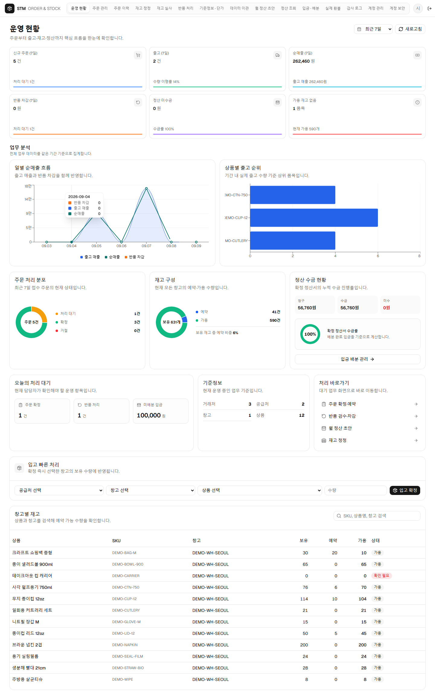
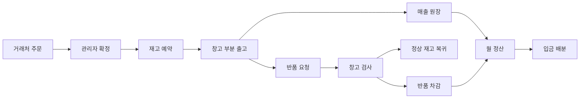
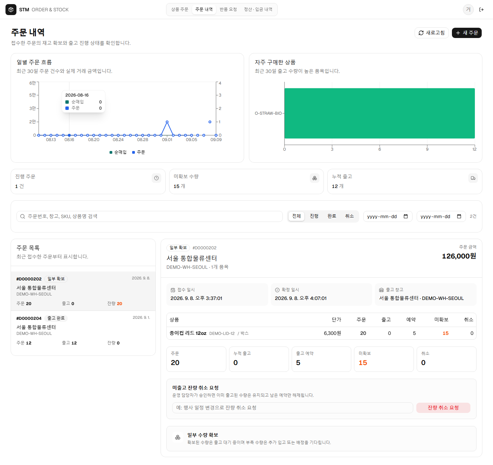
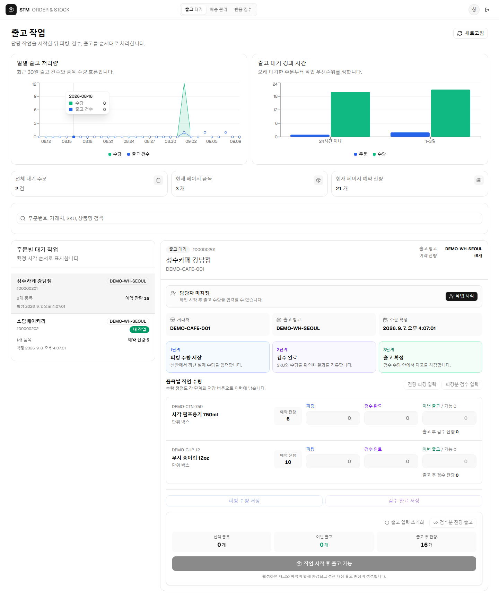

# B2B-STM

운영 배포 절차: [Zorin OS 배포 실행서](docs/overview/zorin-deployment-runbook.md)

중소 식자재·소모품 유통업체를 위한 B2B 주문·재고·출고·반품·정산 시스템입니다. 거래처 주문 포털, 창고 작업 화면, 관리자 화면이 같은 PostgreSQL 업무 원장을 사용합니다.

단순 주문 등록 데모가 아니라 실제 업무에서 문제가 되는 부분 출고, 재고 부족, 동시 주문, 중복 요청, 반품 검사, 마감 후 차감, 입금 배분까지 한 흐름으로 구현했습니다.



## 업무 흐름



- 주문 확정 시 PostgreSQL transaction과 행 잠금으로 최신 가용 재고를 예약합니다.
- 부족한 수량은 미확보 상태로 남기며 추가 입고 후 다시 배정할 수 있습니다.
- 창고는 예약 잔량 안에서 여러 번 부분 출고할 수 있습니다. 출고와 재고 차감, 매출 원장은 한 transaction으로 기록됩니다.
- 모든 변경 명령은 `requestId` 결과를 보존해 재시도와 중복 클릭이 업무를 두 번 반영하지 않게 합니다.
- 반품은 실제 출고행을 기준으로 제한합니다. 정상 수량은 재고로 복귀하고 불량 수량과 차감 금액은 별도로 기록합니다.
- 마감 정산은 수정하지 않습니다. 마감 후 반품은 다음 기간 조정 원장으로 반영합니다.

## 역할별 화면

| 거래처 | 창고 담당자 | 관리자 |
|---|---|---|
| 계약 단가 주문, 진행·출고 조회, 잔량 취소 요청, 반품 요청, 정산·입금 조회 | 출고 대기 우선순위, 주문별 부분 출고, 반품 입고 검사, 정상·불량 판정 | 주문 확정·재배정, 입고·재고 정정, 반품 차감, 월 정산, 입금 배분, 계정·MFA·감사 로그 |

| 거래처 주문 내역 | 창고 출고 작업 |
|---|---|
|  |  |

관리자, 창고, 거래처 화면에는 업무에 맞는 통계가 함께 표시됩니다. 일별 주문·출고·매출 추세, 창고별 재고, 위험 품목, 반품 판정, 월별 청구·수금, 거래처별 미수 순위를 Recharts로 구현했습니다. 통계는 화면에 보이는 일부 목록이 아니라 권한 범위 안의 전체 데이터를 서버에서 집계합니다.

## 기술 구성

| 영역 | 구성 |
|---|---|
| Web | Next.js 16.3.4, React 19, TypeScript, Tailwind CSS, shadcn/ui, Recharts 3.8.0 |
| API | NestJS, TypeScript |
| Database | PostgreSQL 16, migration checksum 검증, 개발·테스트 DB 및 역할 분리 |
| 인증 | 서버 세션, 역할 권한, MFA, CSRF, 로그인 실패 제한 |
| 검증 | Node test runner, 실제 PostgreSQL 통합 테스트, Playwright, 운영 정합성 검사, 백업 복원 리허설 |
| UI | `SDTPL_ADM` 라이트 테마 구조, Geist Sans, 데스크톱·모바일 반응형 화면 |

[대화형 시스템 아키텍처](docs/portfolio/b2b-stm-architecture.html)에서 사용자 역할, API 경계, 업무 모듈, transaction과 PostgreSQL 원장의 연결을 확인할 수 있습니다.

## 로컬 실행

Node.js 24와 PostgreSQL 16이 필요합니다. 기존 PostgreSQL 인스턴스에 별도 개발·테스트 데이터베이스와 역할을 구성합니다.

```powershell
Copy-Item .env.example .env.local
npm.cmd install
npm.cmd run db:migrate
npm.cmd run demo:seed
npm.cmd run build:api
npm.cmd run start:api
```

다른 터미널에서 웹을 실행합니다.

```powershell
npm.cmd run build:web
npm.cmd run start:web
```

- Web: `http://127.0.0.1:3101`
- API readiness: `http://127.0.0.1:3200/api/health/ready`
- 샘플 계정: `demo:seed`가 생성하는 `.demo-credentials.json`에서 확인합니다. 이 파일은 Git에서 제외됩니다.
- 자세한 준비 절차: [개발 환경 구성](docs/overview/development-environment.md)
- 샘플 업무 상태: [데모 데이터 사용 안내](docs/overview/demo-data-guide.md)

## 검증

```powershell
npm.cmd run test:foundation
npm.cmd run build:api
npm.cmd run build:web
npm.cmd run db:verify
npm.cmd run ops:verify
npm.cmd run demo:verify-browser
npm.cmd run ui:verify-recent
npm.cmd run repo:verify-public
```

| 검증 항목 | 최근 결과 |
|---|---|
| PostgreSQL 기반 기능·경계 테스트 | 71/71 통과 |
| 역할별 운영 권한 | 9/9 통과 |
| 관리자·창고·거래처 시각 검증 | 16개 화면의 데스크톱·모바일 32/32 통과 |
| 로컬 조회 스모크 | 동시 작업자 30명, 300건, p95 96.0ms, 예상하지 못한 오류 0건 |
| 의존성 감사 | `npm audit --omit=dev`, 취약점 0건 |
| 공개 저장소 검사 | 제외 규칙 7개, 공개 후보 417개 경로 통과 |

성능 수치는 개발 DB와 샘플 데이터에서 실행한 짧은 회귀 검사 결과입니다. 주문 100,000건, 주문행 1,000,000건, 30분 혼합 부하 시험은 실행하지 않았으며 운영 규모 성능 결과로 표시하지 않습니다.

## 포트폴리오 자료

- [위시켓 프로젝트 설명](docs/portfolio/wishket-project-summary.md)
- [약 10분 데모 진행 순서](docs/portfolio/demo-walkthrough.md)
- [운영 인수 증빙](docs/portfolio/operational-acceptance-evidence.md)
- [대화형 시스템 아키텍처](docs/portfolio/b2b-stm-architecture.html)
- [프로젝트 문서 인덱스](docs/README.md)
